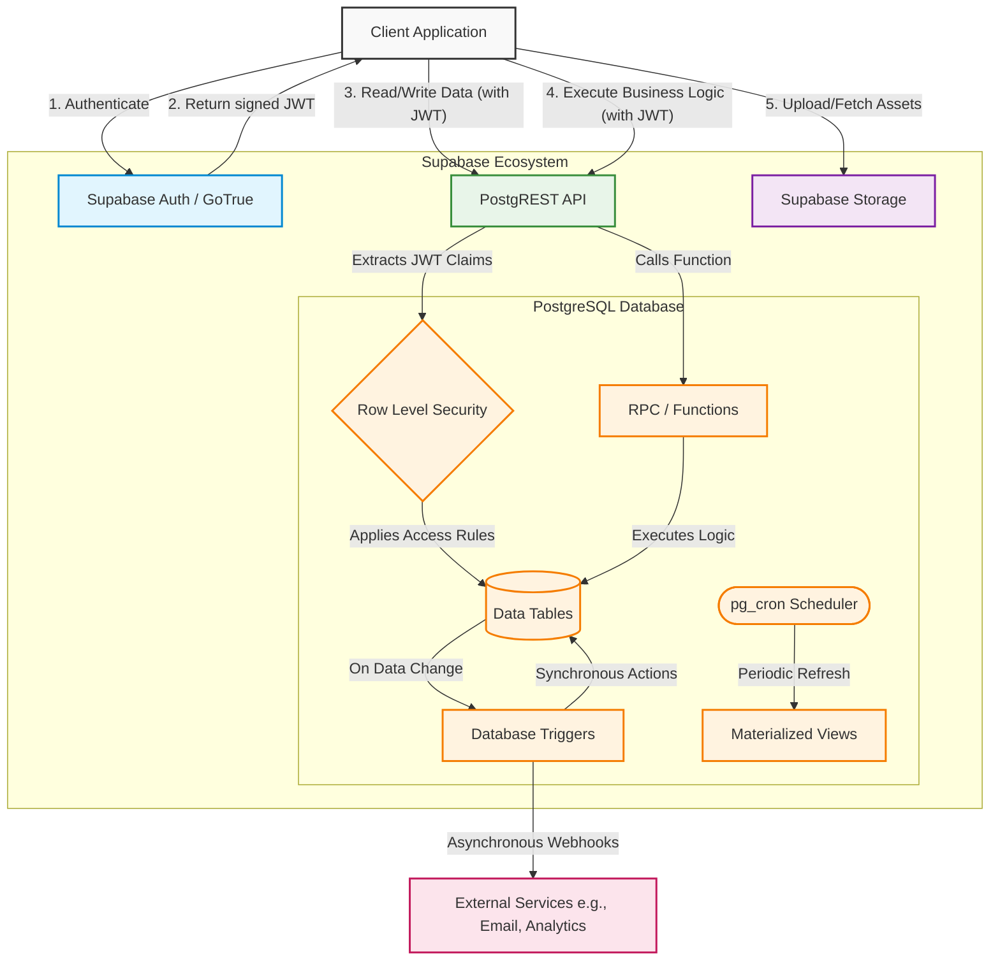

# Multi-Tenant E-Commerce Platform Architecture

## 📌 Executive Summary

This architecture implements a production-grade multi-tenant e-commerce platform using a **Thick Database** pattern. 

*   **Core Infrastructure:** Built exclusively on **Supabase** and **PostgreSQL**.
*   **No Middleware Server:** Traditional middle-tiers (Node.js/Python) are bypassed. Business logic lives entirely within the database.
*   **Strict Isolation:** Guarantees absolute data isolation between vendors using PostgreSQL's native security features.
*   **Unified Instance:** All tenants (vendors) and roles (customers, admins) share a single, scalable PostgreSQL database instance.

---

## 🛠️ Core Technologies

*   **PostgreSQL (Core Database):** Handles data storage, transactional integrity, concurrency, and advanced querying (CTEs, Window Functions).
*   **Supabase Auth (GoTrue):** Manages user identities, session handling, and issues secure JWTs.
*   **Row Level Security (RLS):** Enforces multi-tenancy and Role-Based Access Control (RBAC) at the lowest data tier.
*   **Supabase Storage:** Manages unstructured object storage (e.g., product images) with database-linked security policies.
*   **PostgreSQL Functions & RPC:** Encapsulates complex business rules (like checkout flows) as secure, callable API endpoints.
*   **Database Triggers:** Automates synchronous background tasks (inventory reservations, audit logging, timestamps).
*   **Database Webhooks:** Asynchronously broadcasts events to external systems (e.g., order confirmation emails).
*   **pg_cron (Scheduled Jobs):** Executes periodic tasks, such as refreshing analytical materialized views.

---

## 🏛️ Architectural Principles

*   **Database-Centric Business Logic:**
    *   All critical operations (calculating totals, checking inventory) are written in `plpgsql`.
    *   Prevents race conditions by keeping logic and data execution on the same layer.
    *   Ensures client applications cannot bypass fundamental business rules.
*   **Strict Multi-Tenancy via RLS:**
    *   Uses a logical separation model (shared tables, separate rows).
    *   RLS policies mathematically guarantee that Vendor A cannot access Vendor B's data.
    *   Tenant context is dynamically extracted from the user's JWT at execution time.
*   **Defense in Depth:**
    *   *Network:* Firewalls restrict database access to approved IP ranges.
    *   *Authentication:* Supabase Auth verifies user identity.
    *   *Authorization:* RLS policies filter data access based on role and vendor affiliation.
    *   *Execution:* `SECURITY DEFINER` functions ensure sensitive logic runs with strict, explicit permissions.
*   **ACID Compliance & Transactional Integrity:**
    *   Financial operations (checkout) are wrapped in atomic transactions.
    *   Failures trigger immediate rollbacks, preventing partial order states.
    *   Concurrency controls (e.g., `SELECT ... FOR UPDATE`) eliminate race conditions during high-volume sales.

---

## 🏗️ System Architecture & Data Flow

The following flowchart illustrates how a client request flows through the architectural layers of the platform, from authentication down to database triggers.

---

## 🔐 Role-Based Access Control (RBAC) Flow

The RBAC system dynamically assigns permissions based on database-level mappings.

*   **Customer:** 
    *   *Access:* Own profile, own cart, own orders, own addresses.
    *   *Read-Only:* Active products, categories.
*   **Vendor Employee:** 
    *   *Access:* Inventory, products, and orders linked to their mapped vendor (`vendor_members`).
*   **Vendor Manager / Owner:** 
    *   *Access:* Full vendor settings, coupons, employee management for their specific vendor.
*   **Platform Admin:** 
    *   *Access:* Global system administration across all vendors.
*   **Anonymous:** 
    *   *Access:* Read-only access to the public product catalog.

### RBAC Resolution Flow
1.  **Authentication:** User logs in via Supabase Auth.
2.  **Request:** Client sends API request with JWT.
3.  **Context Injection:** PostgREST parses JWT and injects `auth.uid()` into the database context.
4.  **Policy Evaluation:** RLS queries `profiles` and `vendor_members` to resolve the user's role and vendor affiliations.
5.  **Execution:** The operation is permitted or denied dynamically at the row level.

---

## 🚀 Scalability Considerations

*   **Read-Heavy Traffic:** Route catalog and dashboard queries to Supabase Read Replicas.
*   **Complex Analytics:** Rely on pre-computed Materialized Views refreshed via `pg_cron` rather than calculating metrics on the fly.
*   **Query Performance:** Utilize robust B-Tree, specialized JSONB, and composite indexing strategies to maintain sub-millisecond query execution.
