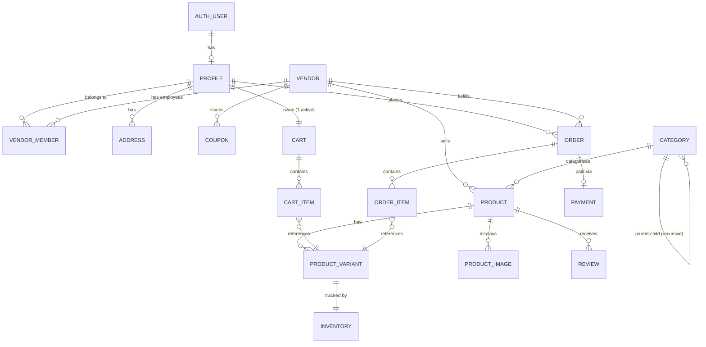

# Database Design & Schema

## 📌 Schema Overview

The database is designed to be highly relational, ensuring referential integrity while supporting the complexities of a multi-vendor ecosystem. 

*   **Primary Keys:** UUIDs are used universally to prevent predictable ID iteration and to simplify data merging across distributed systems.
*   **Foreign Keys:** Strict relationships ensure no orphaned records (e.g., an order item must belong to a valid order and variant).
*   **Timestamping:** Standardized `created_at` and `updated_at` columns across all major tables, maintained automatically via database triggers.
*   **Soft Deletes:** Used selectively (e.g., `deleted_at` on products) to maintain historical order integrity even if a vendor removes a product from their catalog.

---

## 🗺️ Entity Relationship Diagram (ERD)

The following diagram illustrates the core relationships between entities in the multi-tenant architecture.

---

## 🗄️ Core Tables & Relationships

### 1. User Identity & Multi-Tenancy
*   **`profiles`**: Extends the `auth.users` system table. Stores `id`, `full_name`, `phone`, and `role`.
*   **`vendors`**: The core tenant table. Contains `id`, `name`, `slug`, `owner_id`, and `status`.
*   **`vendor_members`**: A many-to-many junction table linking users (`profiles.id`) to `vendors.id` to establish Vendor Employee/Manager permissions.

### 2. Product Catalog
*   **`categories`**: Supports infinite hierarchical nesting via a self-referencing `parent_id` foreign key.
*   **`products`**: The core catalog entity. Linked to `vendor_id` and `category_id`.
*   **`product_variants`**: Handles variations (size, color) using a highly flexible `attributes` JSONB column.
*   **`inventory`**: Strictly tracks stock levels for variants, including `quantity` and `reserved_quantity` to handle race conditions during checkout.

### 3. Purchasing Flow
*   **`carts` & `cart_items`**: Manages active shopping sessions. Restricted to one active cart per user.
*   **`orders` & `order_items`**: Immutable records of purchases. Historical prices are copied to `order_items.unit_price` at the time of checkout to prevent historical data corruption if catalog prices change.
*   **`payments`**: Tracks transaction status and payment methods.

### 4. System & Observability
*   **`audit_logs`**: Captures sensitive `INSERT`, `UPDATE`, and `DELETE` operations, storing `old_data` and `new_data` as JSONB payloads.
*   **`notifications`**: System-generated alerts for order statuses, payment failures, etc.

---

## 🔒 Data Integrity & Constraints

Robust database constraints are enforced to prevent application logic bugs from corrupting the database.

*   **Primary / Foreign Keys:** Enforced strictly across the schema.
*   **NOT NULL:** Applied to all required fields (e.g., `price`, `user_id`).
*   **UNIQUE:** Enforced on `slug` fields (categories, products, vendors), `sku` (variants), and coupon `code`.
*   **CHECK Constraints:**
    *   `price >= 0`: Ensures products cannot be sold for negative amounts.
    *   `quantity >= 0`: Prevents negative inventory balances.
    *   `reserved_quantity >= 0` AND `reserved_quantity <= quantity`: Guarantees we cannot reserve stock we do not have.
    *   `rating BETWEEN 1 AND 5`: Validates review scores.
*   **DEFAULT:** Utilized for timestamps (`now()`), statuses (`'pending'`), and numeric fields (e.g., `0` for stock).

### Deletion Strategy
*   **`ON DELETE CASCADE`**: Used where a child record is meaningless without the parent (e.g., deleting a `vendor` cascades to `vendor_members`; deleting an `order` cascades to `order_items`).
*   **`ON DELETE RESTRICT`**: Used to prevent dangerous deletions (e.g., preventing the deletion of a `product` if it exists in an `order_item`).
*   **`ON DELETE SET NULL`**: Used for non-critical relationships (e.g., deleting a user might set their `user_id` to null on historical reviews, keeping the review text intact but anonymizing it).

---

## 📄 JSONB Implementation

PostgreSQL's `JSONB` data type is utilized where schema flexibility is critical, preventing the need for overly complex entity-attribute-value (EAV) tables.

*   **`product_variants.attributes`**: Stores variant-specific data such as `{ "color": "black", "size": "XL", "storage": "256GB" }`. This allows indexing and filtering (e.g., finding all "black" products) without needing separate tables for every possible attribute.
*   **`audit_logs.old_data` & `.new_data`**: Captures a perfect snapshot of the row state before and after a mutation, facilitating easy rollback and historical auditing.
