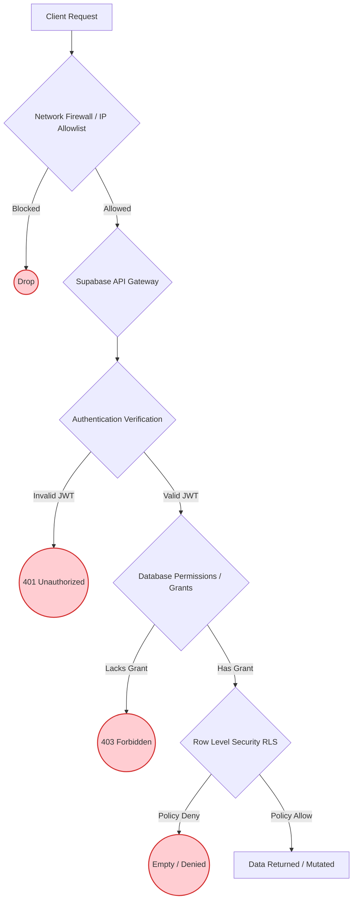

# Security Architecture

## 📌 Security Overview

This document details the security posture of the multi-tenant e-commerce platform. Because the architecture bypasses a traditional middle-tier application server, security is enforced entirely at the **API layer (PostgREST)** and the **Database layer (PostgreSQL)**. 

The core philosophy is **Defense in Depth**: if one layer of security is compromised or misconfigured, subsequent layers will prevent unauthorized access.

---

## 🛡️ Authentication & Authorization

### 1. Authentication (Supabase Auth)
*   **Provider:** Supabase Auth (GoTrue).
*   **Mechanism:** Users authenticate via email/password or OAuth providers. Upon success, the client receives a cryptographically signed JSON Web Token (JWT).
*   **API Security:** The frontend **never** holds direct database credentials. All database interactions occur over HTTPS via the PostgREST API using the JWT in the Authorization header.

### 2. Application Authorization (Role-Based Access Control)
*   **Role Storage:** User roles (e.g., `customer`, `vendor_admin`, `platform_admin`) are stored securely in the `profiles` table. 
*   **Zero Trust:** Roles passed from the frontend client are explicitly ignored. The database inherently untrusts the client and dynamically resolves the user's role and vendor affiliations using the `vendor_members` table during query execution.

---

## 🔒 Layered Defense Strategy

---

## 🔑 PostgreSQL Roles & Grants

PostgreSQL natively handles API access scoping through database roles. We utilize three primary roles managed by Supabase:

*   **`anon` (Anonymous):** 
    *   Used for unauthenticated requests.
    *   *Grants:* `SELECT` access only on public catalogs (e.g., active products, categories). No `INSERT`, `UPDATE`, or `DELETE` rights.
*   **`authenticated`:** 
    *   Used for requests containing a valid JWT.
    *   *Grants:* Basic CRUD privileges on application tables. However, these grants are completely overridden by Row Level Security (RLS). Having the grant simply allows the query to *attempt* execution.
*   **`service_role`:** 
    *   A high-privilege bypass role.
    *   *Usage:* Used **strictly** by backend edge functions, database triggers, or scheduled jobs. 
    *   *Rule:* The `SUPABASE_SERVICE_ROLE_KEY` must **never** be exposed to the browser or frontend clients.

### Database Permissions vs. RLS Policies
*   **Database Permissions (`GRANT`):** Dictate *what operations* a role can perform on a table (e.g., "The `authenticated` role is allowed to run `SELECT` and `INSERT` on the `orders` table").
*   **RLS Policies:** Dictate *which specific rows* the role can perform that operation on (e.g., "The `authenticated` role can only `SELECT` orders where `user_id = auth.uid()`").

---

## ⚙️ Security Definer Functions

Certain operations require elevated privileges that the standard `authenticated` user does not possess. For example, a customer checking out needs to update `inventory`, but a customer should generally not have direct `UPDATE` grants on the `inventory` table.

To solve this, we use PostgreSQL `SECURITY DEFINER` functions.

*   **Concept:** A function defined with `SECURITY DEFINER` executes with the privileges of the user that *created* the function (usually a superuser or admin), rather than the user *calling* it.
*   **Implementation Requirements:**
    *   **Minimal Privileges:** Only used when absolutely necessary (e.g., complex checkout flows).
    *   **Explicit `search_path`:** Always defined with `SET search_path = public` to prevent malicious schema hijacking.
    *   **Proper `EXECUTE` Permissions:** `REVOKE ALL ON FUNCTION ... FROM PUBLIC` is used, explicitly granting `EXECUTE` only to the `authenticated` role.
    *   **Internal Validation:** The function internally performs strict validations (verifying ownership, checking quantities) before modifying data, acting as a secure gatekeeper.

---

## 🚫 Environment & Secrets Management

*   **Public Variables:** Only the `VITE_SUPABASE_URL` and `VITE_SUPABASE_ANON_KEY` (which are safe for public clients) are exposed to the frontend.
*   **Private Secrets:** Database passwords, `SUPABASE_SERVICE_ROLE_KEY`, and external API keys (e.g., Stripe) are securely stored as Supabase Environment Variables or Vault secrets and are completely inaccessible to the frontend.
*   **Error Handling:** The API suppresses raw PostgreSQL error messages from reaching the client to prevent information leakage regarding database schema or internal states.
